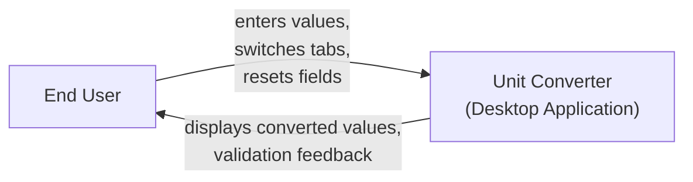
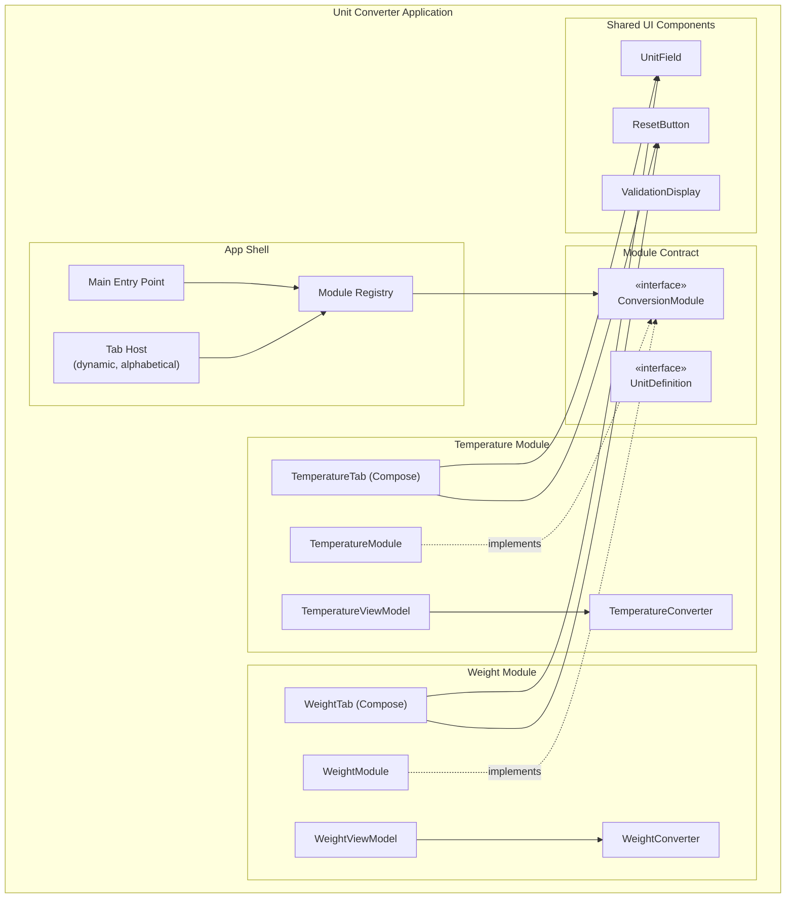
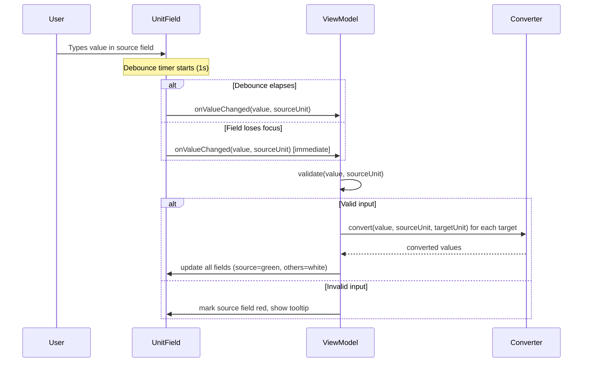
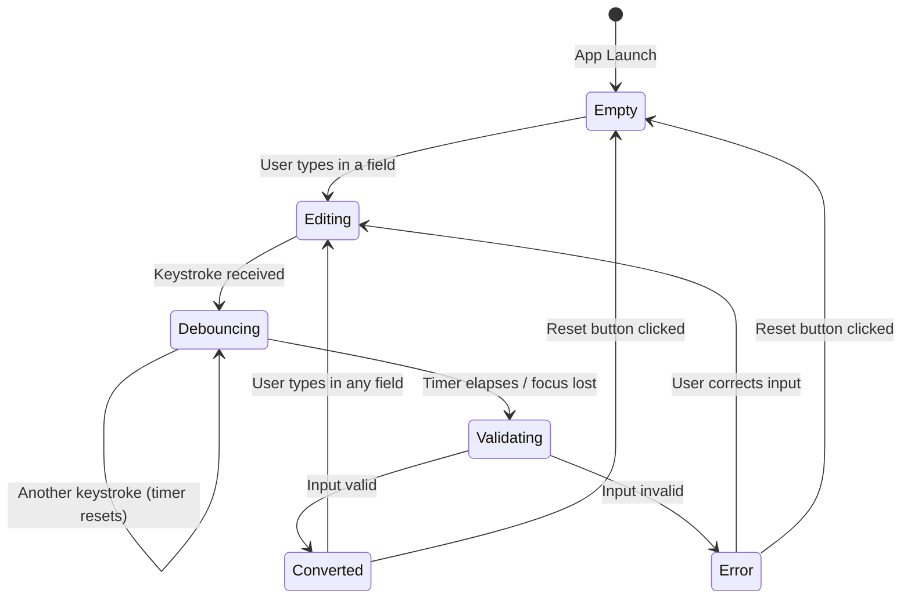

# Unit Converter — Solution Architecture Document (SAD)

**Project:** Unit Converter  
**Technical Name:** `unit-converter`  
**PRD:** [Product Requirements Document](../requirements/prd.md)  
**Glossary:** [Project Glossary](../requirements/glossary.md)

---

## 1. System Context

The Unit Converter is a standalone desktop application with no external system dependencies. It runs entirely on the user's machine with no network access, no backend services, and no persistent storage.

### Actors

| Actor | Description |
|-------|-------------|
| End User | Interacts with the GUI to perform unit conversions |

### System Context Diagram



There are no external systems, APIs, databases, or network services. The application is fully self-contained.

---

## 2. Architectural Decisions

Key decisions are recorded as ADRs in [`docs/adr/`](../adr/). Summary:

| ADR | Decision | Rationale |
|-----|----------|-----------|
| [ADR-001](../adr/adr_001_modular_architecture.md) | Modular Monolith with Module Registry | Extensibility via self-contained conversion modules without the overhead of dynamic plugin loading |
| [ADR-002](../adr/adr_002_state_management.md) | Unidirectional Data Flow with per-tab ViewModel | Predictable state, clean separation of UI and logic, isolated tab state |
| [ADR-003](../adr/adr_003_conversion_engine_design.md) | Canonical (base) unit conversion strategy | Simplifies adding units — each unit only needs to/from-base conversions |
| [ADR-004](../adr/adr_004_ui_testing_strategy.md) | compose.uiTest with JUnit 4 for desktop UI tests | Feasible with current Compose Multiplatform tooling; satisfies QA wish |

---

## 3. Component Architecture

### 3.1 Architectural Pattern

The application follows a **Modular Monolith** pattern with **MVVM** (Model-View-ViewModel) within each module. This combines:

- A single deployable unit (monolith) for simplicity
- Strict module boundaries for extensibility
- MVVM for clean separation of conversion logic, state management, and UI

### 3.2 Component Diagram



### 3.3 Component Responsibilities

| Component | Responsibility |
|-----------|---------------|
| Main Entry Point | Bootstraps the application, initializes the module registry, launches the Compose window |
| Module Registry | Holds the list of registered `ConversionModule` instances; provides them sorted alphabetically to the Tab Host |
| Tab Host | Renders tabs dynamically from registered modules; manages tab selection; preserves per-tab state |
| ConversionModule (interface) | Contract that every conversion module must implement: name, units, conversion logic, UI composable |
| UnitDefinition (interface) | Describes a single unit: name, abbreviation, validation rules |
| TemperatureModule / WeightModule | Concrete implementations of `ConversionModule` |
| *ViewModel | Manages state for one tab: current input values, active field, validation errors, debounce |
| *Converter | Pure functions for unit conversion logic (no UI, no state) |
| *Tab (Compose) | Compose UI for one tab, using shared components |
| UnitField | Reusable composable: labeled text input with unit abbreviation, validation styling (red/green/white), tooltip |
| ResetButton | Reusable composable: clears all fields on the current tab |
| ValidationDisplay | Tooltip rendering for validation error messages |

---

## 4. Module Contract

The module contract is the central abstraction that enables extensibility. Every conversion module implements this interface.

```
ConversionModule
├── name: String                          // Display name, used for tab label and sorting
├── units: List<UnitDefinition>           // Units supported by this module
├── convert(value, fromUnit, toUnit): Result  // Convert between two units
├── validate(value, unit): ValidationResult   // Domain-specific validation
└── content: @Composable (ViewModel) -> Unit  // The tab's UI
```

```
UnitDefinition
├── name: String           // e.g., "Celsius"
├── abbreviation: String   // e.g., "°C"
└── validators: List<Validator>  // Domain-specific constraints (e.g., absolute zero)
```

### Adding a New Module

To add a new conversion category (e.g., Length):

1. Create a new module package (e.g., `module.length`)
2. Implement `ConversionModule` and its units
3. Register the module in the `ModuleRegistry`
4. No changes to existing modules or core UI logic required

This satisfies REQ-011 (Modular Conversion Architecture).

---

## 5. Conversion Engine Design

### 5.1 Canonical Unit Strategy

Each module designates one unit as the **canonical (base) unit**. Conversions always go through the base unit:

```
Source Unit → Base Unit → Target Unit
```

This means each unit only needs two functions: `toBase(value)` and `fromBase(value)`.

**Temperature:** Base unit = Kelvin  
**Weight:** Base unit = Gram

### 5.2 Conversion Flow



### 5.3 Temperature Formulas

Base unit: Kelvin (K)

| From | To Kelvin | From Kelvin |
|------|-----------|-------------|
| Celsius (°C) | K = °C + 273.15 | °C = K − 273.15 |
| Fahrenheit (°F) | K = (°F + 459.67) × 5/9 | °F = K × 9/5 − 459.67 |
| Kelvin (K) | identity | identity |

Domain constraint: K ≥ 0 (absolute zero). Values below 0 K are rejected with an explanatory message.

### 5.4 Weight Formulas

Base unit: Gram (g)

| From | To Gram | From Gram |
|------|---------|-----------|
| Gram (g) | identity | identity |
| Kilogram (kg) | g = kg × 1000 | kg = g / 1000 |
| Ounce (oz) | g = oz × 28.3495 | oz = g / 28.3495 |
| Pound (lb) | g = lb × 453.592 | lb = g / 453.592 |

No domain constraints — negative values are accepted.

---

## 6. State Management

### 6.1 Pattern

Each tab has its own **ViewModel** that holds:

- Field values (one per unit)
- Which field is the active input (source)
- Validation state per field (valid, invalid + error message)
- Debounce state

State is preserved when switching tabs because each ViewModel persists independently in memory.

### 6.2 State Flow



### 6.3 Reset Behavior

The Reset button clears all state for the current tab's ViewModel only:
- All field values → empty
- All validation states → cleared
- Active field → none

Other tabs are unaffected (REQ-008).

---

## 7. UI Architecture

### 7.1 Layout Structure

```
┌─────────────────────────────────────────┐
│  [Temperature]  [Weight]                │  ← Tab bar (alphabetical)
├─────────────────────────────────────────┤
│                                         │
│  ┌─────────────────────────────────┐    │
│  │  Celsius (°C)                   │    │
│  │  ┌───────────────────────────┐  │    │
│  │  │  [input field]            │  │    │  ← UnitField (stacked vertically)
│  │  └───────────────────────────┘  │    │
│  └─────────────────────────────────┘    │
│                                         │
│  ┌─────────────────────────────────┐    │
│  │  Fahrenheit (°F)                │    │
│  │  ┌───────────────────────────┐  │    │
│  │  │  [input field]            │  │    │
│  │  └───────────────────────────┘  │    │
│  └─────────────────────────────────┘    │
│                                         │
│  ┌─────────────────────────────────┐    │
│  │  Kelvin (K)                     │    │
│  │  ┌───────────────────────────┐  │    │
│  │  │  [input field]            │  │    │
│  │  └───────────────────────────┘  │    │
│  └─────────────────────────────────┘    │
│                                         │
│           [ Reset ]                     │  ← Reset button
│                                         │
└─────────────────────────────────────────┘
```

### 7.2 Visual Feedback

| State | Field Background | Tooltip |
|-------|-----------------|---------|
| Active input (source) | Light green | — |
| Computed output | White | — |
| Invalid input | Red | Error explanation |
| Empty (default) | White | — |

### 7.3 Responsive Design

- The layout uses Compose's built-in layout system (Column, Row, Modifier.fillMaxWidth)
- Fields stretch to fill available width
- Font sizes are set larger than default for readability (REQ-012)
- Vertical stacking ensures the layout adapts naturally to window resizing

---

## 8. Input Handling

### 8.1 Debounce Mechanism

- On each keystroke in a field, a coroutine-based timer starts (or resets) with a 1-second delay
- When the timer elapses, conversion is triggered
- If the field loses focus before the timer elapses, conversion triggers immediately
- Implementation: Kotlin coroutines with `delay()` and `Job` cancellation

### 8.2 Validation Pipeline

Validation occurs in two stages:

1. **Syntax validation:** Can the input be parsed as a `Double`? (Includes scientific notation like `1.5e3`)
2. **Domain validation:** Does the parsed value satisfy domain constraints? (e.g., Kelvin ≥ 0)

Validation triggers on blur (focus lost). If valid, conversion proceeds. If invalid, the field is marked red with a tooltip.

### 8.3 Output Formatting

- Results are rounded to a maximum of 4 decimal places
- Standard decimal notation is used by default
- Scientific notation is used only when the rounded result would be illegible in decimal form (e.g., extremely large or small values)

---

## 9. Project Structure

```
unit-converter/
├── build.gradle.kts                  # Root build script
├── settings.gradle.kts               # Project settings
├── gradle/
│   └── libs.versions.toml            # Version catalog
└── src/
    ├── main/kotlin/
    │   └── unitconverter/
    │       ├── Main.kt               # Application entry point
    │       ├── app/
    │       │   ├── App.kt            # Root composable (window, tab host)
    │       │   └── ModuleRegistry.kt # Module registration and discovery
    │       ├── core/
    │       │   ├── ConversionModule.kt   # Module contract interface
    │       │   ├── UnitDefinition.kt     # Unit description interface
    │       │   ├── ValidationResult.kt   # Validation result types
    │       │   └── Formatter.kt          # Output formatting (4 dp, sci notation)
    │       ├── ui/
    │       │   ├── UnitField.kt      # Reusable unit input field composable
    │       │   ├── ResetButton.kt    # Reset button composable
    │       │   └── Theme.kt          # App theme (large fonts, colors)
    │       └── module/
    │           ├── temperature/
    │           │   ├── TemperatureModule.kt
    │           │   ├── TemperatureConverter.kt
    │           │   └── TemperatureViewModel.kt
    │           └── weight/
    │               ├── WeightModule.kt
    │               ├── WeightConverter.kt
    │               └── WeightViewModel.kt
    └── test/kotlin/
        └── unitconverter/
            ├── core/
            │   └── FormatterTest.kt
            ├── module/
            │   ├── temperature/
            │   │   ├── TemperatureConverterTest.kt
            │   │   └── TemperatureValidationTest.kt
            │   └── weight/
            │       └── WeightConverterTest.kt
            └── ui/
                └── TabSwitchingTest.kt   # compose.uiTest (if feasible)
```

This is a single Gradle module (not multi-module) since compile-time registration is sufficient. The package structure enforces logical separation. If runtime plugin loading is needed in the future, the `module` packages can be extracted into separate Gradle modules with minimal refactoring.

---

## 10. Testing Strategy

### 10.1 Unit Tests

- **Scope:** Conversion logic (`*Converter`), validation, formatting
- **Framework:** `kotlin-test` + `junit-jupiter`
- **Coverage target:** ≥ 80% line coverage for business logic
- **Approach:** TDD — tests written before implementation

Key test scenarios:
- All conversion formulas (round-trip accuracy)
- Absolute zero boundary (0 K, −273.15 °C, −459.67 °F)
- Below absolute zero rejection
- Invalid input (non-numeric strings)
- Scientific notation parsing
- Output formatting (4 decimal places, scientific notation threshold)
- Negative values for weight (accepted)

### 10.2 UI Tests

- **Scope:** Tab switching with state preservation, reset button behavior, field visual states
- **Framework:** `compose.uiTest` with JUnit 4 (`compose.desktop.uiTestJUnit4`)
- **Feasibility:** Confirmed available for Compose Multiplatform Desktop targets
- **Priority:** Could-have (REQ-015) — implement if time permits

### 10.3 Static Analysis

- **Detekt:** Integrated into Gradle build, default rule set, build fails on violations (REQ-016)
- **Compiler options:** `allWarningsAsErrors = true`, `extraWarnings = true` if supported (REQ-017)

---

## 11. Technology Stack

| Concern | Technology | Version Guidance |
|---------|-----------|-----------------|
| Language | Kotlin | Latest stable (2.3.x) |
| UI Framework | Compose Multiplatform (Desktop) | Latest stable (1.10.x) |
| Build Tool | Gradle (Kotlin DSL) | Latest stable |
| JDK | JDK 25 | As specified in PRD |
| Unit Testing | kotlin-test + junit-jupiter | Latest stable |
| UI Testing | compose.desktop.uiTestJUnit4 | Bundled with Compose Multiplatform |
| Static Analysis | Detekt | Latest stable |
| Version Catalog | Gradle Version Catalog (libs.versions.toml) | — |

---

## 12. Cross-Cutting Concerns

### 12.1 Error Handling

- Input parsing errors are caught and surfaced as validation messages (never crashes)
- Arithmetic edge cases (overflow, NaN, Infinity) are handled gracefully with appropriate error messages
- No network or I/O errors to handle (fully offline application)

### 12.2 Performance

- Debounce prevents excessive recalculation
- Conversions are simple arithmetic — performance is not a concern
- Compose's recomposition model ensures only affected fields re-render

### 12.3 Accessibility

- Large fonts improve readability (REQ-012)
- Color-coded fields (red/green/white) provide visual feedback
- Tooltips provide textual error explanations
- Note: Full accessibility compliance requires manual testing with assistive technologies

### 12.4 Security

- No network access, no data persistence, no user authentication
- No security concerns beyond standard desktop application sandboxing

---

## 13. Risk Register

| # | Risk | Likelihood | Impact | Mitigation |
|---|------|-----------|--------|------------|
| R1 | `compose.uiTest` for desktop may have limitations or instability | Medium | Low | UI tests are Could-have (REQ-015); fallback is manual testing. Core conversion logic is tested via unit tests. |
| R2 | `extraWarnings = true` may not be supported or may produce excessive false positives in current Kotlin version | Low | Low | Verify compatibility during project setup; disable if it causes build issues with generated Compose code. |
| R3 | JDK 25 compatibility with Compose Multiplatform tooling | Low | Medium | Verify early in project setup; fall back to latest supported JDK if needed. |
| R4 | Floating-point precision in conversions may cause unexpected rounding | Low | Medium | Use `Double` arithmetic with explicit rounding to 4 decimal places; test boundary values thoroughly. |

---

## 14. Deployment

- No packaging or installer required (REQ-010)
- Application is run via Gradle task: `./gradlew run`
- Target platforms: Windows, macOS, Linux (via JVM + Compose Multiplatform)
- No CI/CD pipeline required currently

---

## 15. Implementation Roadmap

Suggested implementation sequence:

1. **Project setup:** Gradle build, dependencies, Detekt, compiler options
2. **Core contracts:** `ConversionModule`, `UnitDefinition`, `ValidationResult`, `Formatter`
3. **Temperature module:** Converter (TDD), ViewModel, validation (absolute zero)
4. **Shared UI components:** `UnitField`, `ResetButton`, theme
5. **App shell:** Module registry, tab host, main window
6. **Weight module:** Converter (TDD), ViewModel
7. **Integration:** Wire everything together, manual testing
8. **UI tests:** compose.uiTest for tab switching and reset (if feasible)
9. **Polish:** Edge cases, output formatting, responsive layout tuning

---

## Traceability Matrix

| Requirement | Architectural Component(s) |
|-------------|---------------------------|
| REQ-001 Temperature Conversion | TemperatureConverter, TemperatureModule, TemperatureViewModel |
| REQ-002 Weight Conversion | WeightConverter, WeightModule, WeightViewModel |
| REQ-003 Tab-Based Navigation | TabHost, ModuleRegistry (alphabetical sorting) |
| REQ-004 Default State | ViewModel initialization (all empty) |
| REQ-005 Input Validation | ValidationResult, UnitDefinition.validators, ViewModel |
| REQ-006 Output Formatting | Formatter |
| REQ-007 Debounced Live Calculation | ViewModel (coroutine-based debounce) |
| REQ-008 Reset Button | ResetButton, ViewModel.reset() |
| REQ-009 Desktop Cross-Platform | Compose Multiplatform, JDK 25 |
| REQ-010 Build and Run | Gradle (Kotlin DSL), `./gradlew run` |
| REQ-011 Modular Architecture | ConversionModule interface, ModuleRegistry, package structure |
| REQ-012 Responsive UI | Compose layout, Theme (large fonts) |
| REQ-013 Unit Test Coverage | *ConverterTest, *ValidationTest (≥80%) |
| REQ-014 Absolute Zero Tests | TemperatureConverterTest, TemperatureValidationTest |
| REQ-015 Compose UI Testing | compose.desktop.uiTestJUnit4, TabSwitchingTest |
| REQ-016 Detekt | Gradle Detekt plugin, default rules |
| REQ-017 Strict Compiler Options | Gradle kotlinOptions configuration |
